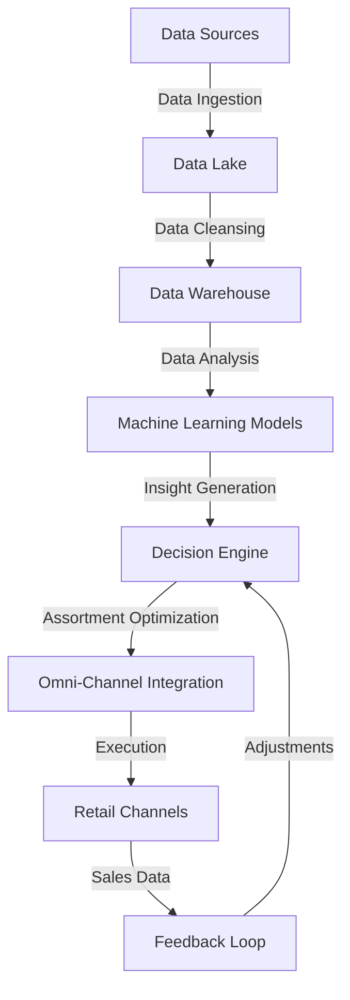
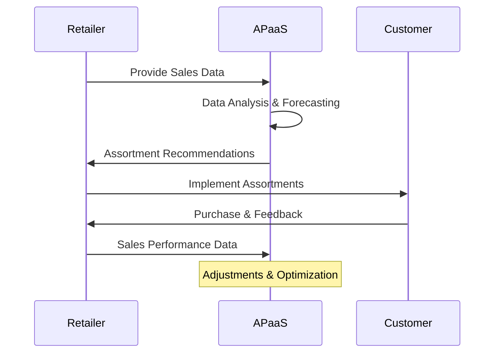

# Assortment Planning as a Service for Retail Excellence

Welcome to the future of retail assortment planning, where precision meets efficiency in crafting the perfect product mix. Our Assortment Planning as a Service (APaaS) leverages the latest in machine learning, generative AI, and data analytics to transform how retailers approach inventory, forecasting, and customer engagement. Dive into a journey where data-driven decision-making leads to unparalleled retail success.

## Envisioning Retail Transformation

In the dynamic world of retail, staying ahead means understanding your customers deeply and responding to their needs with agility. APaaS is not just a tool; it's a transformational service designed to align your product offerings with customer demand, ensuring that every shelf and online catalog resonates with your market's pulse.

### The Journey of Assortment Planning

Our service encapsulates the essence of modern retail strategies, encompassing:

- **Strategic Forecasting**: Predictive models that analyze historical sales data, market trends, and customer behavior to forecast demand with astonishing accuracy.
- **Dynamic Assortment Optimization**: Algorithms that tailor product mixes to maximize profitability and customer satisfaction, adjusting in real-time to sales trends and inventory levels.
- **Personalized Customer Insights**: Deep learning techniques that parse through customer data to uncover preferences and trends, enabling personalized assortment decisions.

### A Symphony of Data and Technology

At the core of APaaS lies a sophisticated orchestration of data, technology, and retail expertise:

- **Data Ingestion and Cleansing**: The first movement begins with gathering diverse data sources, ensuring a clean, accurate foundation for analysis.
- **Analytical Processing**: Advanced machine learning models process the data, extracting actionable insights and predictive forecasts.
- **Assortment Decision Engine**: A decision-making engine utilizes these insights to recommend optimal product assortments, sizes, and quantities.
- **Feedback Loop for Continuous Improvement**: Sales performance and customer feedback data feed back into the system, refining and optimizing future assortments.

## Architectural Masterpiece

Imagine a service architecture that seamlessly integrates with your existing systems, designed for scalability, security, and performance. Below is a conceptual architecture diagram illustrating the interconnected components that make this possible, from data ingestion pipelines to analytics platforms and the user interface where decisions come to life.

### The Pillars of Our Service

- **Central Product Database**: The heart of our service, containing detailed product information and historical performance data.
- **Business Intelligence Platform**: The brain, generating insights, reports, and dashboards to guide decision-making.
- **Omni-Channel Integration**: The veins, ensuring that assortment decisions flow smoothly across all retail channels, from brick-and-mortar to e-commerce.
- **Security and Compliance Framework**: The shield, protecting data integrity and privacy across the service.

### Process Flow

To further detail the operational flow, the following Mermaid diagram showcases the step-by-step process from data gathering to implementation and feedback.

## Transformative Outcomes

Retailers who embark on this journey with us witness transformative outcomes:

- **Increased Sales and Margins**: Optimized assortments lead to higher sales velocity and improved profit margins.
- **Enhanced Customer Satisfaction**: Products that meet and exceed customer expectations foster loyalty and brand advocacy.
- **Operational Efficiency**: Streamlined processes and data-driven decisions reduce overstock and stockouts, optimizing inventory levels.

Adjusting the tone to focus more on the pragmatic aspects of Assortment Planning as a Service (APaaS), the conclusion can be streamlined to directly address the benefits and the forward-looking aspect of implementing this solution in retail operations. Here's a refined conclusion that emphasizes these points without the marketing flair.

## Conclusion: The Path Forward with Assortment Planning as a Service

In the evolving landscape of retail, the adoption of Assortment Planning as a Service (APaaS) signifies a strategic shift towards data-driven decision-making, operational efficiency, and enhanced customer satisfaction. APaaS stands at the intersection of technology and retail management, offering a sophisticated toolkit for navigating the complexities of assortment planning in today's competitive market.

### Key Takeaways

- **Data-Driven Decision-Making**: APaaS provides retailers with actionable insights derived from advanced analytics, helping to forecast demand more accurately and tailor assortments to consumer preferences.
- **Operational Efficiency**: By optimizing product mixes and inventory levels, retailers can reduce excess stock and shortages, leading to cost savings and more agile operations.
- **Enhanced Customer Satisfaction**: Aligning product offerings with customer expectations not only boosts sales but also fosters loyalty, enhancing the overall shopping experience.

### The Next Steps

For retailers considering APaaS, the journey begins with understanding the specific challenges and opportunities within their operations. Implementing APaaS involves integrating it into existing systems, training teams to leverage new insights, and adopting a culture of continuous improvement and adaptation.

### Invitation to Collaborate

We encourage retailers to explore how Assortment Planning as a Service can support their goals for growth and efficiency. Our team is ready to assist in evaluating the fit for your operations, implementing the solution, and optimizing its use for maximum benefit.

## Looking Ahead

The adoption of APaaS is more than an upgrade to retail operations; it's a commitment to future-proofing your business in an increasingly digital and consumer-centric world. By leveraging the capabilities of APaaS, retailers can ensure they not only meet but exceed the expectations of their customers, setting a new standard for excellence in retail.
