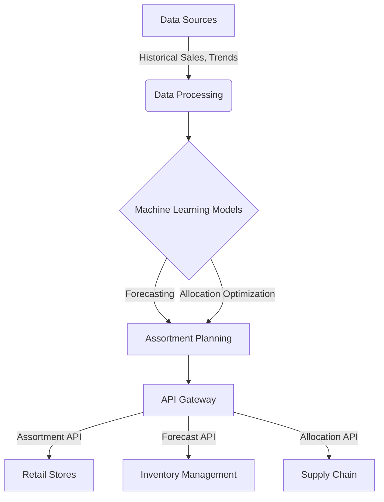

# Detailed Assortment Planning Solution for Retail Company

This document provides an in-depth overview of a comprehensive assortment planning solution designed for a retail company, leveraging advanced machine learning techniques and mathematical models to optimize product offerings across stores and channels.

## Overview

The assortment planning solution revolutionizes the way retail companies approach inventory management, product selection, and customer satisfaction. By integrating data-driven insights with retail expertise, we enable more accurate forecasting, personalized assortment strategies, and efficient inventory optimization.

## Functional Components

### Product Hierarchy and Assortment Building Blocks (ABB)

- **Product Hierarchy**: Organizes retail products into a hierarchical taxonomy, enabling precise management and analysis at various granularity levels, from broad categories to specific styles.
- **Assortment Building Blocks (ABB)**: Modularizes the product offering, allowing stores to tailor assortments to local market demands, enhancing relevance and customer engagement.

### Size Curve Optimization

- Utilizes historical sales data to determine the optimal distribution of sizes for each product, ensuring that demand across sizes is met efficiently, reducing markdowns and improving sell-through rates.

## Machine Learning Integration

### Demand Forecasting

- Employs ARIMA and Prophet models for accurate sales forecasting, taking into account seasonal trends, historical sales data, and market dynamics.

### Inventory Allocation

- Implements operations research techniques and linear programming to optimize stock levels across stores, minimizing overstock and stockout scenarios.

## Mathematical Foundations

- **ARIMA Model**: Delve into the Autoregressive Integrated Moving Average model, discussing its components (autoregression, integration, and moving averages) and how it's applied to time series forecasting.
- **Facebook Prophet**: Explore the decomposable time series model used by Prophet, highlighting its ability to handle seasonality and holidays.
- **Linear Programming**: Explain the linear programming approach for inventory allocation, including objective functions, constraints, and optimization strategies.

## Monte Carlo Simulations

- Outline the application of Monte Carlo simulations in what-if analysis, providing insights into potential outcomes and risks for new product introductions and promotional strategies.

## API Contract and Integration

- Detail the API contract facilitating seamless integration between forecasting, optimization models, and the retail company's internal systems, ensuring modularity and scalability.

### API Endpoints and Attributes

- **Forecast API**, **Allocation API**, **Assortment API**, and **ABB Classification API** descriptions with endpoint details and expected responses, emphasizing attribute-level details for precise control over data exchanges.

## Assortment as a Service

Promoting assortment planning as a service, highlighting how APIs enable dynamic, real-time assortment adjustments in response to changing market conditions, and discussing the "Baseline and Compete" approach for machine learning model selection.

## Overall Architecture

This Mermaid diagram represents the high-level architecture of the assortment planning solution, illustrating the flow from data sources through processing, machine learning model application, to actionable outputs via APIs.

## Conclusion

The assortment planning solution embodies a holistic approach to retail management, combining the precision of machine learning with the flexibility of mathematical optimization and the insights of Monte Carlo simulations. It marks a significant leap towards achieving personalized, dynamic, and efficient retail operations.
