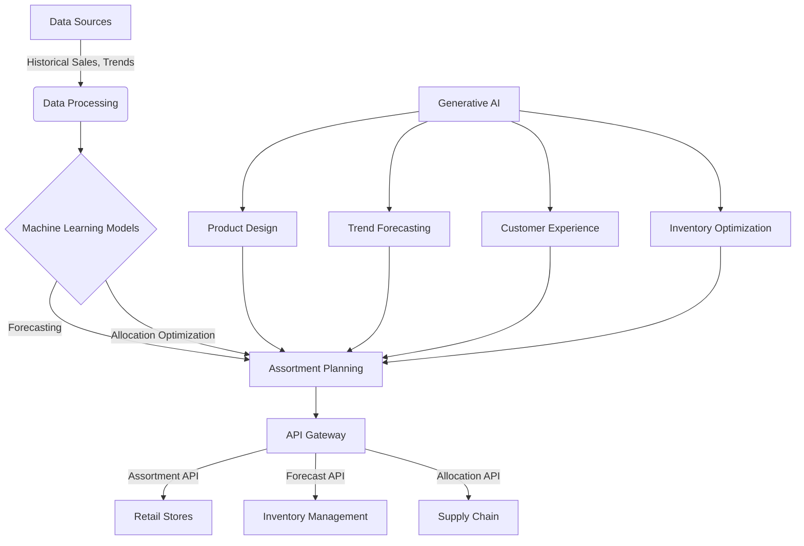

# Detailed Assortment Planning Solution for Retail Company

This document provides an in-depth overview of a comprehensive assortment planning solution designed for a retail company, leveraging advanced machine learning techniques and mathematical models to optimize product offerings across stores and channels.

## Overview

The assortment planning solution revolutionizes the way retail companies approach inventory management, product selection, and customer satisfaction. By integrating data-driven insights with retail expertise, we enable more accurate forecasting, personalized assortment strategies, and efficient inventory optimization.

## Functional Components

### Product Hierarchy and Assortment Building Blocks (ABB)

- **Product Hierarchy**: Organizes retail products into a hierarchical taxonomy, enabling precise management and analysis at various granularity levels, from broad categories to specific styles.
- **Assortment Building Blocks (ABB)**: Modularizes the product offering, allowing stores to tailor assortments to local market demands, enhancing relevance and customer engagement.

### Size Curve Optimization

- Utilizes historical sales data to determine the optimal distribution of sizes for each product, ensuring that demand across sizes is met efficiently, reducing markdowns and improving sell-through rates.

## Machine Learning Integration

### Demand Forecasting

- Employs ARIMA and Prophet models for accurate sales forecasting, taking into account seasonal trends, historical sales data, and market dynamics.

### Inventory Allocation

- Implements operations research techniques and linear programming to optimize stock levels across stores, minimizing overstock and stockout scenarios.

## Mathematical Foundations

- **ARIMA Model**: Delve into the Autoregressive Integrated Moving Average model, discussing its components (autoregression, integration, and moving averages) and how it's applied to time series forecasting.
- **Facebook Prophet**: Explore the decomposable time series model used by Prophet, highlighting its ability to handle seasonality and holidays.
- **Linear Programming**: Explain the linear programming approach for inventory allocation, including objective functions, constraints, and optimization strategies.

## Monte Carlo Simulations

- Outline the application of Monte Carlo simulations in what-if analysis, providing insights into potential outcomes and risks for new product introductions and promotional strategies.

## API Contract and Integration

- Detail the API contract facilitating seamless integration between forecasting, optimization models, and the retail company's internal systems, ensuring modularity and scalability.

### API Endpoints and Attributes

- **Forecast API**, **Allocation API**, **Assortment API**, and **ABB Classification API** descriptions with endpoint details and expected responses, emphasizing attribute-level details for precise control over data exchanges.

## Assortment as a Service

Promoting assortment planning as a service, highlighting how APIs enable dynamic, real-time assortment adjustments in response to changing market conditions, and discussing the "Baseline and Compete" approach for machine learning model selection.

## Overall Architecture

This  diagram represents the high-level architecture of the assortment planning solution, illustrating the flow from data sources through processing, machine learning model application, to actionable outputs via APIs.

## Enhancing Assortment Planning with Generative AI

Generative AI, leveraging algorithms like Generative Adversarial Networks (GANs) and Variational Autoencoders (VAEs), presents a frontier in retail assortment planning. These technologies can innovate in product design, customer experience, and inventory management by generating new product ideas, predicting future fashion trends, and simulating customer responses to different assortments.

### Applications in Retail:

- **Product Design and Innovation**: Generative AI can analyze current fashion trends and customer preferences to propose new designs or alterations to existing products, ensuring the retail offerings are always ahead of the curve.

- **Trend Forecasting**: By synthesizing historical sales data, current market trends, and social media sentiments, generative models can forecast future trends, enabling retailers to plan their assortments proactively.

- **Customer Experience Personalization**: Simulating customer preferences and behaviors, generative AI can help in crafting highly personalized shopping experiences, from personalized product recommendations to virtual try-on features.

- **Inventory and Supply Chain Optimization**: Generative models can simulate various supply chain scenarios, helping in optimizing inventory levels, distribution strategies, and logistics, thereby reducing costs and improving efficiency.

### Implementing Generative AI:

- **Data Collection and Processing**: Gather extensive data on sales, customer feedback, social media, and fashion trends as input for training generative models.
- **Model Training and Evaluation**: Select and train appropriate generative AI models, continuously evaluating and refining them based on performance and relevance to assortment planning goals.
- **Integration into Assortment Planning Processes**: Seamlessly integrate generative AI insights into the existing assortment planning framework, leveraging API contracts for data exchange and decision-making support.

Generative AI has the potential to transform retail assortment planning into a dynamic, proactive process that not only responds to current market demands but anticipates future trends and customer needs, driving innovation and competitive advantage in the retail space.

## Conclusion

The assortment planning solution embodies a holistic approach to retail management, combining the precision of machine learning with the flexibility of mathematical optimization and the insights of Monte Carlo simulations. It marks a significant leap towards achieving personalized, dynamic, and efficient retail operations.
